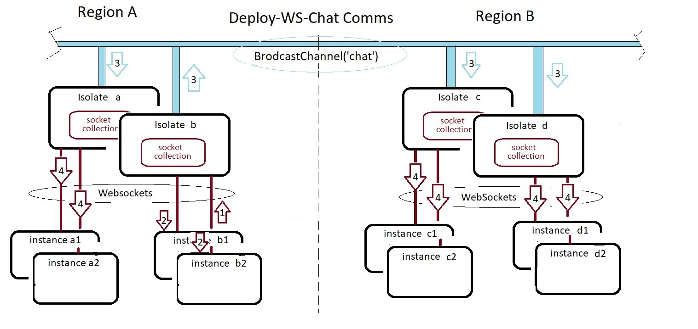

## Deno Deploy WebSocket Chat App

 * Native HTTP/WS -> BroadcastChannel
 * Zero dependencies (zero imports)
 * Only two files (index.html, server.ts)

## run it  https://deploy-socket-chat.deno.dev/
